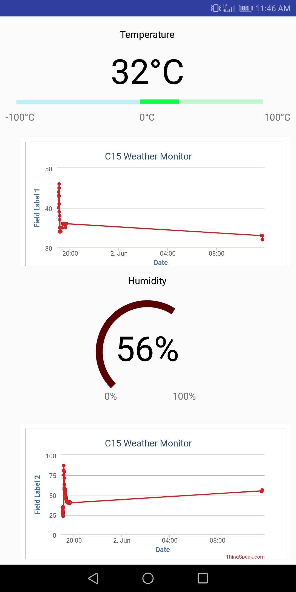

<h2><b>Weather Monitoring System with IOT and Android Application</b></h2>
<h6>
The proposed system is a simpler approach for monitoring the weather conditions namely temperature and Humidity levels at a particular place and make the information available anywhere in the world. The technology behind this is Internet of Things (IoT) and mobile applications, which are an advanced and efficient solutions for connecting the things to the internet, to connect the entire world of things in a network and browsing data remotely, respectively. Here things might be like electronic gadgets and sensors. The system deals with monitoring the environmental conditions like temperature and relative humidity with sensors and sends the information to the to a web cloud and then plot the sensor data as graphical statistics.

The data retrieved from the implemented system can be accessible at any remote location with online cloud services like ThingSpeak which acts as an intermediate to access the information. The information is viewed on a mobile application developed with Java on Android Platform. Sensors in this system collect information in a constant interval of time and upload the data to the cloud. The application periodically updates provide the end user with live temperature and humidity levels in a simpler and clean format with graphical representation of the values over a period of time.
</h6>

<ol>
<li><h3>Requirements</h3></li>
You need to install:
<ul><li>Android Studio</li><li>Arduino IDE</li></ul>
 
Hardware Requirements:
<ul><li>Arduino Uno<li>DHT11 Sensor<li>Wires<li>16x2 LCD<li>ESP8266 Wifi Module<li>Breadboard</ul>
 
Other Essential Requirements:
<ul><li>Thingspeak account</ul>

<li><h3><b>Deploying and testing</b></h3></li>
<ol>
<li>Connect all the hardware componenets as per the diagram attached
<li>Connect the Arduino Uno to the PC and select the PORT
<li>Once it is connected, Compile the "Heat Sensor Program.ino" in Arduino IDE 
<li>Upon successfull compilation, dump/push the code into Arduino Uno
<li>You will be able to see the output of the sensors on the LCD.
<li>Compile and build the android studio project and generate the apk.
<li>Install the apk in mobile to see the end results of the IOT system.
</ol>

</ol>
